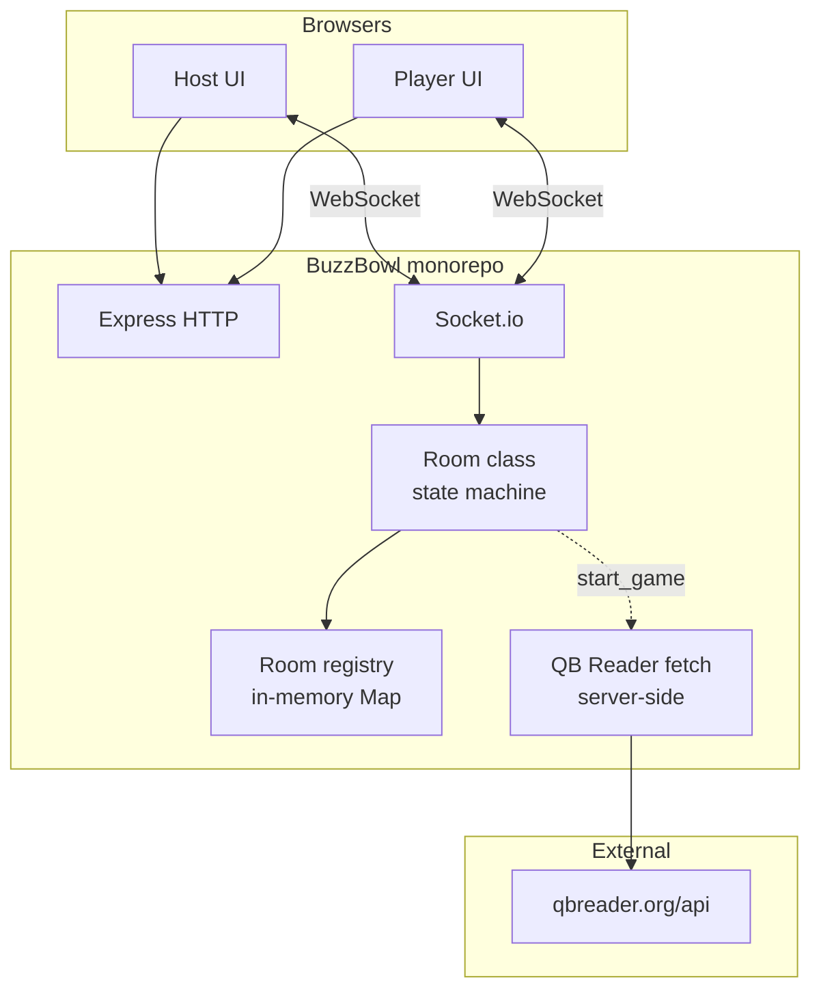
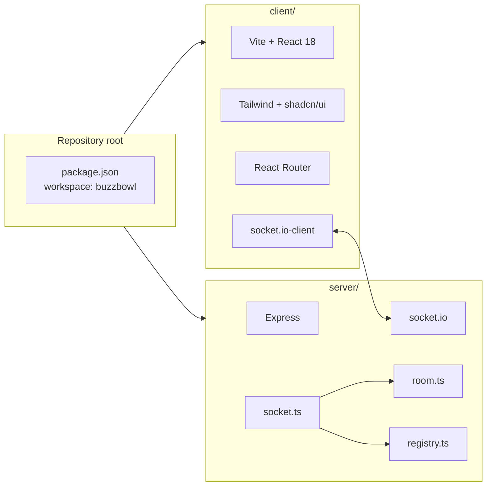
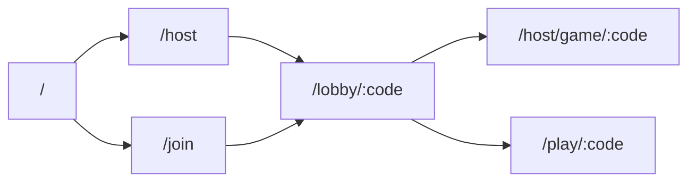
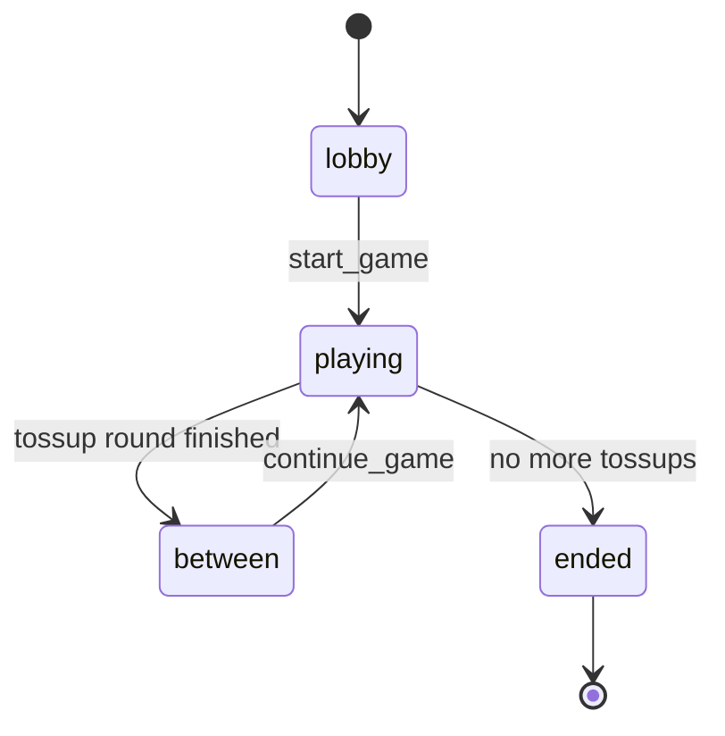

# BuzzBowl — architecture (current)

High-level view of what exists **today** in the repo. **Answer privacy (v1):** per-tossup `readerPlayerId`, reader-only answer on the wire during play, full answer on the break screen for everyone. Still planned: Jeopardy source, optional TV-only route — see [BACKLOG.md](./BACKLOG.md).

---

## System context

---

## Monorepo layout

---

## Client routes (logical)

---

## Socket.io — main server events (summary)

| Direction | Events (examples) |
|-----------|-------------------|
| Client → server | `create_room`, `host_join`, `player_join`, `player_identify`, `set_game_mode`, `set_player_team`, `update_settings`, `start_game`, `pause_reveal`, `resume_reveal`, `show_full_question`, `buzz`, `mark_correct`, `mark_incorrect`, `skip_question`, `continue_game` |
| Host vs reader on controls | For `pause_reveal`, `resume_reveal`, `show_full_question`, `mark_*`, `skip_question`: body may include **`hostSecret`** (lobby host) or **`playerId`** (must be the current tossup reader in `playing`). For `continue_game` in `between`: **`hostSecret`** or **`playerId`** matching `betweenControlsPlayerId`. |
| Server → room | `game_state` (room snapshot; **answer line** omitted for non-readers during `playing`; reader matches `socket.data.playerId === readerPlayerId`) |

---

## Room lifecycle (server)

---

## Planned / partial

Documented in [BACKLOG.md](./BACKLOG.md):

- **Jeopardy-style** question option (e.g. JService) alongside QB Reader.
- **Answer privacy — remaining:** judging from reader phone, dedicated cast-only display if the host machine is mirrored.

**Implemented:** rotating reader per tossup (`readerPlayerId`), reader excluded from buzz, per-socket `game_state` for the printed answer during play, `lastRoundAnswer` on the `between` screen for all clients, reader-only socket controls for reveal / judge / skip / next tossup (`betweenControlsPlayerId` on break), HostLive display-first.

---

## Related docs

- [BACKLOG.md](./BACKLOG.md) — deferred tasks and design notes
- [BuzzBowl-Product-Design-v0.2.md](./BuzzBowl-Product-Design-v0.2.md) — product spec
- [v1-decisions.md](./v1-decisions.md) — implementation defaults
